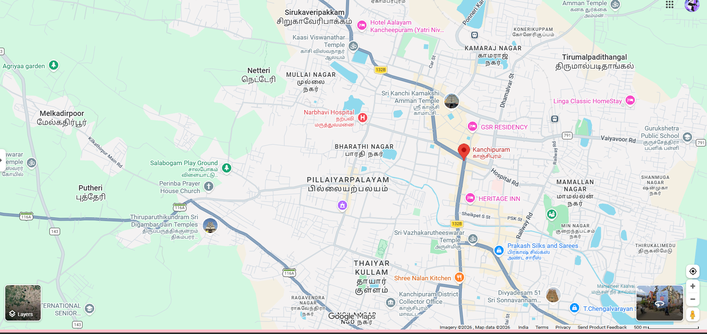
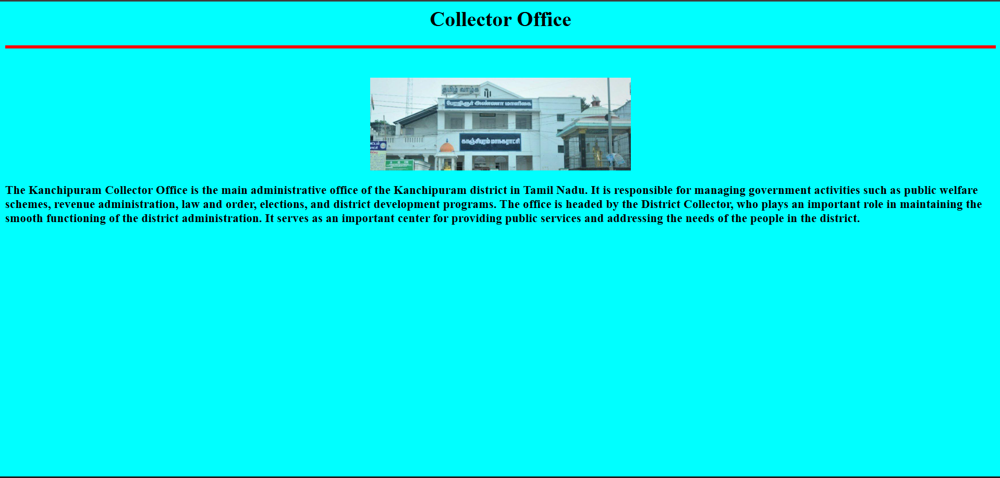
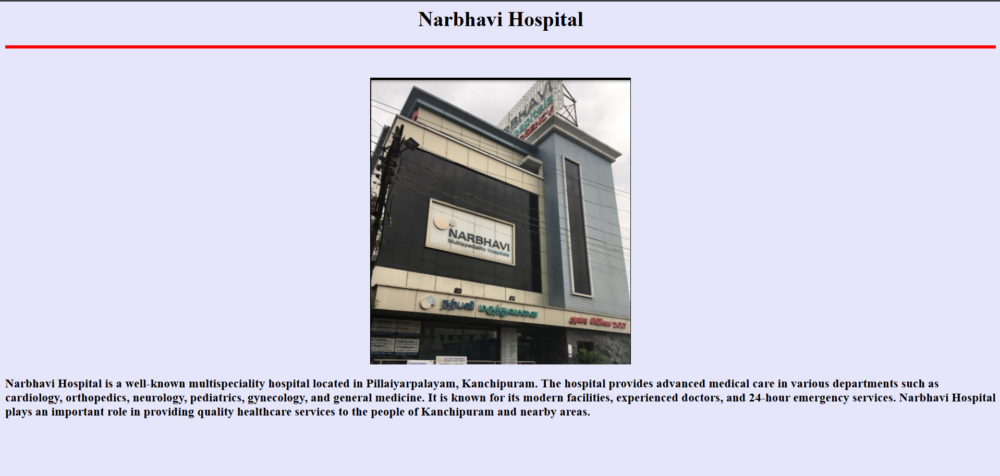
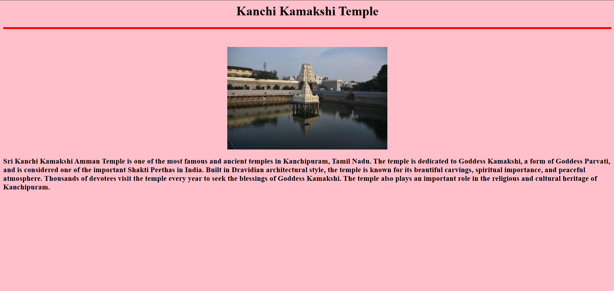
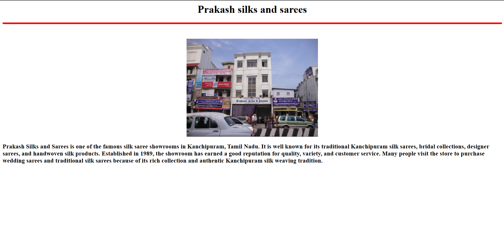
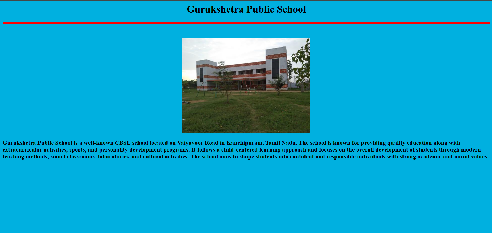

# Ex03 Places Around Me
## Date: 

## AIM
To develop a website to display details about the places around my house.

## DESIGN STEPS

### STEP 1
Create a Django admin interface.

### STEP 2
Download your city map from Google.

### STEP 3
Using ```<map>``` tag name the map.

### STEP 4
Create clickable regions in the image using ```<area>``` tag.

### STEP 5
Write HTML programs for all the regions identified.

### STEP 6
Execute the programs and publish them.

## CODE
5places.html
```
<html>
    <head>
        <title>Kanchipuram</title>
    </head>
    <body bgcolor="pink">
        <h1 align="center">Kanchipuram</h1>
        <h2 align="center">Mohana Priya D (212225230182)</h2>
        

<map name="image-map">
    <area target="" alt="Nambhavi Hospital" title="Nambhavi Hospital" href="Hospital.html" coords="1004,387,814,305" shape="rect">
    <area target="" alt="Kamakshi Temple" title="Kamakshi Temple" href="Ktemple.html" coords="1139,294,112" shape="circle">
    <area target="" alt="Prakash silks " title="Prakash silks " href="Sarees.html" coords="1325,674,1561,734" shape="rect">
    <area target="" alt="Gurukshetra school" title="Gurukshetra school" href="School.html" coords="1720,353,1735,449,1828,336,1789,380,1821,361,1693,397,1836,464,1831,332,1728,334" shape="poly">
    <area target="" alt="Collector office" title="Collector office" href="Collector.html" coords="1061,786,1252,888" shape="rect">
</map>

    </body>
</html>
```
Collector.html
```
<html>
    <head>
        <title>Coffice</title>
    </head>
    <body bgcolor="aqua">
        <h1 align="center">Collector Office</h1>
        <hr size="5", color="red"><br><br>
        <center>
            
        </center>
        
        <h3 >The Kanchipuram Collector Office is the main administrative office of the Kanchipuram 
            district in Tamil Nadu. It is responsible for managing government activities such as 
            public welfare schemes, revenue administration, law and order, elections, and district 
            development programs. The office is headed by the District Collector, who plays an 
            important role in maintaining the smooth functioning of the district administration. 
            It serves as an important center for providing public services and addressing the needs 
            of the people in the district.

    </body>
</html>
```
Hospital.html
```
<html>
    <head>
        <title>Hospital</title>
    </head>
    <body bgcolor="Lavender">
        <h1 align="center">Narbhavi Hospital</h1>
        <hr size="5", color="red"><br><br>
        <center>
            
        </center>
        
        <h3 >Narbhavi Hospital is a well-known multispeciality hospital located in Pillaiyarpalayam, 
Kanchipuram. The hospital provides advanced medical care in various departments such as
cardiology, orthopedics, neurology, pediatrics, gynecology, and general medicine. 
It is known for its modern facilities, experienced doctors, and 24-hour emergency services. 
Narbhavi Hospital plays an important role in providing quality healthcare services to the
people of Kanchipuram and nearby areas. 

    </body>
</html>
```
Ktemple.html
```
<html>
    <head>
        <title>Temple</title>
    </head>
    <body bgcolor="Pink">
        <h1 align="center">Kanchi Kamakshi Temple</h1>
        <hr size="5", color="red"><br><br>
        <center>
            
        </center>
        
        <h3 >Sri Kanchi Kamakshi Amman Temple is one of the most famous and ancient
             temples in Kanchipuram, Tamil Nadu. The temple is dedicated to Goddess Kamakshi,
            a form of Goddess Parvati, and is considered one of the important Shakti
             Peethas in India. Built in Dravidian architectural style, the temple is known
              for its beautiful carvings, spiritual importance, and peaceful atmosphere. 
              Thousands of devotees visit the temple every year to seek the blessings of
               Goddess Kamakshi. The temple also plays an important role in the religious
                and cultural heritage of Kanchipuram.

    </body>
</html>
```
Sarees.html
```
<html>
    <head>
        <title>Textiles</title>
    </head>
    <body bgcolor=" White">
        <h1 align="center">Prakash silks and sarees</h1>
        <hr size="5", color="red"><br><br>
        <center>
            
        </center>
        
        <h3 >Prakash Silks and Sarees is one of the famous silk saree showrooms
            in Kanchipuram, Tamil Nadu. It is well known for its traditional 
            Kanchipuram silk sarees, bridal collections, designer sarees, and handwoven
             silk products. Established in 1989, the showroom has earned a good reputation 
             for quality, variety, and customer service. Many people visit the store to
              purchase wedding sarees and traditional silk sarees because of its rich 
              collection and authentic Kanchipuram silk weaving tradition.

    </body>
</html>
```
School.html
```
<html>
    <head>
        <title>School</title>
    </head>
    <body bgcolor=" Sky blue">
        <h1 align="center">Gurukshetra Public School</h1>
        <hr size="5", color="red"><br><br>
        <center>
            
        </center>
        
        <h3 >Gurukshetra Public School is a well-known CBSE school located on 
            Vaiyavoor Road in Kanchipuram, Tamil Nadu. The school is known for providing
             quality education along with extracurricular activities, sports, and
              personality development programs. It follows a child-centered learning 
              approach and focuses on the overall development of students through modern
               teaching methods, smart classrooms, laboratories, and cultural activities.
                The school aims to shape students into confident and responsible individuals
                 with strong academic and moral values.

    </body>
</html>
```


## OUTPUT









## RESULT
The program for implementing image maps using HTML is executed successfully.
